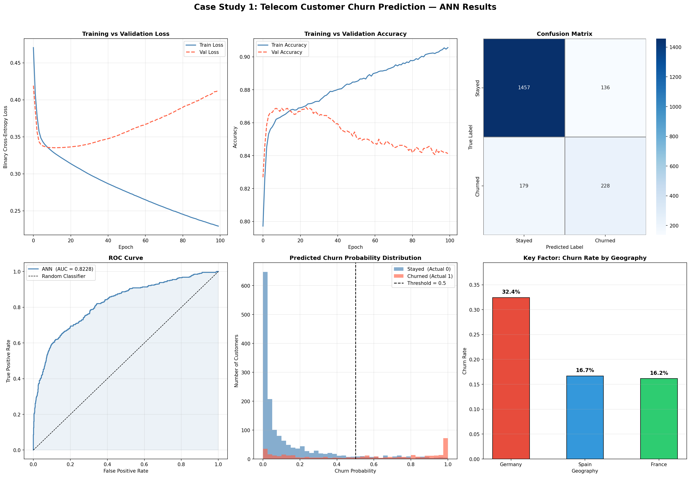

# Customer Churn Prediction using ANN

Predicts whether a bank customer will churn using an Artificial Neural Network built with TensorFlow/Keras on a dataset of 10,000 customers.

## Project Structure

```
├── churn_ann.py                                        # Main script
├── churn_ann_results.png                               # Output visualizations
├── Image/                                              # Result screenshots
└── data/
    └── Artificial_Neural_Network_Case_Study_data.csv
```

## Model Architecture

| Layer | Details |
|-------|---------|
| Input + Hidden 1 | Dense(64, ReLU) → BatchNorm → Dropout(0.3) |
| Hidden 2 | Dense(32, ReLU) → BatchNorm → Dropout(0.2) |
| Hidden 3 | Dense(16, ReLU) → Dropout(0.1) |
| Output | Dense(1, Sigmoid) |

- Optimizer: Adam | Loss: Binary Crossentropy
- Callbacks: EarlyStopping, ReduceLROnPlateau

## Results




## Tech Stack

Python · TensorFlow/Keras · Scikit-learn · Pandas · NumPy · Matplotlib · Seaborn

## Installation & Usage

```bash
pip install tensorflow scikit-learn pandas numpy matplotlib seaborn
python churn_ann.py
```

## Connect with Me

- GitHub: [Ankit2006Raj](https://github.com/Ankit2006Raj)
- LinkedIn: [Ankit Raj](https://www.linkedin.com/in/ankit-raj-226a36309)
- Email: ankit9905163014@gmail.com
